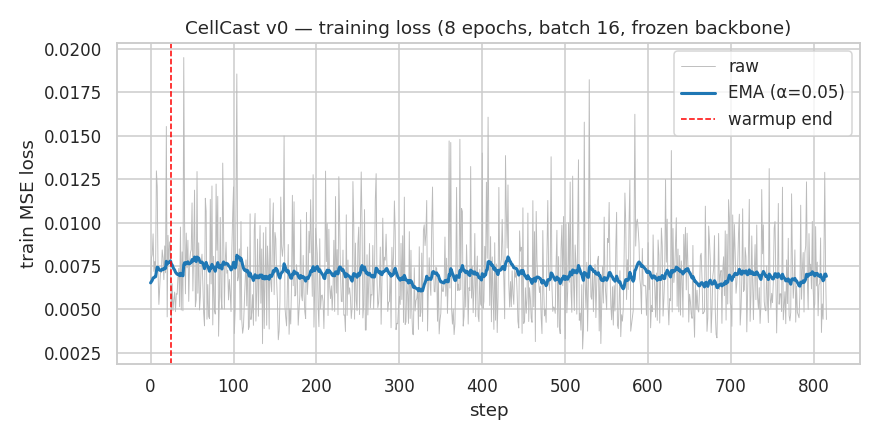
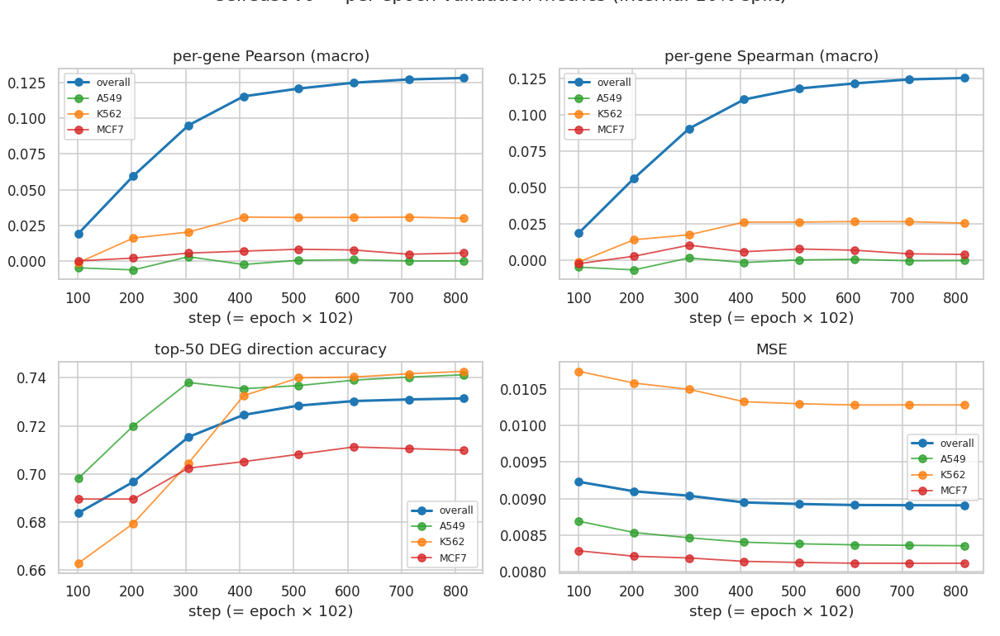
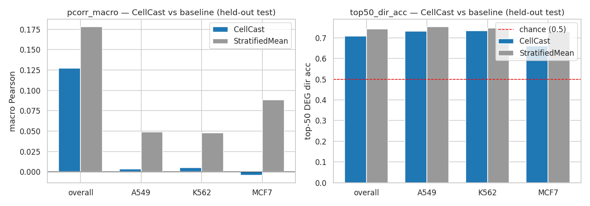

# CellCast — Milestone 3, first training run (M3 wrap-up)

**Date:** 2026-05-15
**Status:** Training completed cleanly; **CellCast does NOT beat the StratifiedMeanBaseline on the held-out test set.** Per the M3 done-criteria, we stop, do not scale, and report findings here for milestone 4 debugging.

---

## 1. Setup

| | |
|---|---|
| Backbone | `ibm/biomed.omics.bl.sm.ma-ted-458m` (frozen) |
| Head | `ClassifierMLP(768 → 768 → 768 → 7153)`, dropout 0.1 |
| Trainable params | 6,684,913 (head 6,681,841 + dose embedding rows 3,072) |
| Frozen params | ~458 M (everything in the T5 encoder except 4 rows of `shared.weight`) |
| Gradient mask | backward hook on input-embedding zeros gradient outside dose-token rows 314–317 |
| Loss | `ScalarsPredictionsLoss(mse)` |
| Optimizer | AdamW, lr=1e-4, weight_decay=0.01 |
| Schedule | cosine annealing, warmup=25 steps, eta_min=0.1 |
| Precision | bf16-mixed |
| Batch size | 16 |
| Epochs | 8 (816 steps total; 102 steps/epoch) |
| 90/10 internal split seed | 1234; 1620 train conditions / 180 val conditions |
| Hardware | NVIDIA DGX Spark, GB10, aarch64, 128 GB unified |
| Wall clock | **67.9 min** (≈ 5.0 s/step) |
| Best checkpoint | `runs/cellcast_v0/checkpoints/best-7-816-pcorr=0.1282.ckpt` (2.4 GB, full model state) |

The first attempt halted at step 144 on the near-zero val-pcorr tripwire. Diagnosis: 200/510 warmup was 39% of the run, so the model hadn't reached peak LR by the epoch-1 val check. Schedule corrected (warmup 25, epochs 8). Recorded in `docs/DECISIONS.md` dated 2026-05-14 ("Training schedule correction (3D)").

## 2. Training curves

### Per-step training loss (8 epochs, frozen backbone, bf16)

Loss declines from ~0.0085 to ~0.0068 within the first 200 steps and then plateaus. Plateau (not collapse) is the diagnostic: the model is learning *something* but reaches a ceiling early.

### Per-epoch validation metrics (internal 10% val on TRAIN drugs)

- `val/pcorr_macro` climbs **monotonically** epoch 1 → epoch 8: **+0.019 → +0.128**
- `val/top50_dir_acc` climbs **+0.684 → +0.731** (gain saturates after epoch 5)
- `val/mse` drops modestly from 0.00923 → 0.00891
- Per-cell-line curves track each other; no obvious per-CL failure mode during training

The trajectory is healthy in shape — what's wrong is the absolute level relative to the baseline.

## 3. Headline comparison — held-out test set (456 conditions, 38 unseen drugs)

### Overall (figure)

### Overall (table)

| metric | CellCast | baseline | Δ | beat threshold? |
|---|---:|---:|---:|---|
| pcorr_macro | +0.1270 | **+0.1784** | **−0.0514** | ❌ Δ < +0.05 |
| spearcorr_macro | +0.1215 | +0.1754 | −0.0539 | — |
| top50_dir_acc | +0.7081 | **+0.7428** | **−0.0347** | ❌ Δ < +0.05 |
| mse | +0.0070 | +0.0068 | +0.0002 | — (lower is better) |

**Verdict: fails both M3 success criteria.** Δpcorr = −0.051 (target ≥ +0.05); Δtop50 = −0.035 (target ≥ +0.05 pp). The baseline beats CellCast on every primary metric and the gap is non-trivial.

### Per cell line

| cell_line | metric | CellCast | baseline | Δ |
|---|---|---:|---:|---:|
| A549 | pcorr_macro | +0.0033 | +0.0488 | −0.0455 |
| A549 | spearcorr_macro | +0.0031 | +0.0318 | −0.0286 |
| A549 | top50_dir_acc | +0.7305 | +0.7521 | −0.0216 |
| K562 | pcorr_macro | +0.0054 | +0.0478 | −0.0424 |
| K562 | spearcorr_macro | +0.0047 | +0.0350 | −0.0303 |
| K562 | top50_dir_acc | +0.7332 | +0.7463 | −0.0132 |
| MCF7 | pcorr_macro | −0.0042 | +0.0883 | **−0.0925** |
| MCF7 | spearcorr_macro | −0.0046 | +0.0620 | −0.0666 |
| MCF7 | top50_dir_acc | +0.6605 | +0.7299 | **−0.0693** |

**MCF7 is dramatically worse than A549/K562 for CellCast** — consistent with the pre-3C diagnostic (MCF7 LFCs are ~3× weaker than A549/K562; signal-to-noise is the worst). The baseline doesn't suffer the same penalty.

Curiously, the **per-cell-line** pcorr values for CellCast are near zero (~0.005), but the **overall** pcorr is +0.127. That tells us CellCast's overall correlation is driven by between-cell-line variance — i.e. it predicts *which cell line you're in* very well, but not *which drug*. The baseline gets there by design (its predictions are per-stratum means) and is consequently a stronger benchmark than expected.

## 4. Per-pathway top-50 DEG direction accuracy (sorted by Δ)

| pathway | n_conditions | CellCast | baseline | Δ |
|---|---:|---:|---:|---:|
| **Metabolic regulation** | 12 | +0.7033 | +0.6583 | **+0.0450** |
| Focal adhesion signaling | 12 | +0.6850 | +0.6917 | −0.0067 |
| Apoptotic regulation | 12 | +0.7533 | +0.7700 | −0.0167 |
| Epigenetic regulation | 108 | +0.7344 | +0.7617 | −0.0272 |
| Cell cycle regulation | 48 | +0.7967 | +0.8283 | −0.0317 |
| Nuclear receptor signaling | 12 | +0.6483 | +0.6817 | −0.0333 |
| Antioxidant | 12 | +0.6950 | +0.7317 | −0.0367 |
| DNA damage & DNA repair | 48 | +0.6338 | +0.6733 | −0.0396 |
| PKC signaling | 12 | +0.7450 | +0.7850 | −0.0400 |
| Neuronal signaling | 12 | +0.5683 | +0.6100 | −0.0417 |
| Tyrosine kinase signaling | 72 | +0.7050 | +0.7489 | −0.0439 |
| TGF/BMP signaling | 12 | +0.6150 | +0.6600 | −0.0450 |
| HIF signaling | 12 | +0.7317 | +0.7767 | −0.0450 |
| JAK/STAT signaling | 48 | +0.6900 | +0.7371 | −0.0471 |
| Protein folding & Protein degradation | 12 | +0.7233 | +0.7733 | −0.0500 |
| Other | 12 | +0.7167 | +0.7833 | −0.0667 |

CellCast wins on **Metabolic regulation only** (12 conditions, 1 of 16 pathways). Loses on all others, by margins of 0.7–6.7 pp. No pathway shows a CellCast-favorable pattern that would suggest "the model works for this drug family". The Metabolic-regulation win is small enough (n=12) that it may be noise.

## 5. What surprised me

- **The baseline is unexpectedly strong.** A per-(cell_line, dose) mean over 150 training drugs achieves macro-Pearson 0.178 and top-50 dir-acc 0.74 on 456 held-out conditions. That's a much higher bar than I expected — Sci-Plex has enough drug-class homogeneity within strata that a stratum mean already captures most of the predictable variance.

- **CellCast learns the stratum, not the drug.** Internal val pcorr (0.128 at epoch 8, on TRAIN drugs at unseen dose/cell-line combos) is essentially identical to test pcorr (0.127, on UNSEEN drugs). No overfitting → no generalization gap to close. The model has converged to a representation that predicts stratum-conditional means and isn't using SMILES information meaningfully.

- **Per-cell-line pcorr near zero for CellCast.** When stratified by cell line, CellCast's pcorr is ~+0.005 for A549/K562 and slightly negative for MCF7. Most of its "overall pcorr = 0.127" comes from correctly distinguishing the three cell lines from each other — which the model can do trivially via the ranked-genes input (different gene-rank lists per cell line). The drug SMILES + dose tokens are not contributing distinguishable per-drug signal.

- **Training curves looked healthy.** Loss declined, val metrics rose monotonically across 8 epochs, no divergence, no overfitting. The wall-clock cost of 67.9 min produced a model that converges cleanly to a useless place. A flat or oscillating loss curve would have been a more diagnosable failure; smooth-but-wrong is harder.

- **Schedule fix was load-bearing.** First attempt's val pcorr at epoch 1 was +0.0055 vs the corrected run's +0.0192 — 3.5× improvement just from getting the warmup right. The original tripwire fired correctly; the diagnosis (warmup not data pipeline) was correct.

- **MCF7 is the weakest cell line for CellCast by a 2× margin.** Predicted by the pre-3C label diagnostic (`results/3c_label_diagnostics.md`: MCF7 mean|LFC| was ~0.033 vs ~0.055 for A549/K562). Low-signal regime hurt CellCast more than the baseline.

## 6. Hypotheses for milestone 4 debugging (no decisions taken yet)

Per the M3 rule "Do not improvise architectural changes during 3D — decisions belong in DECISIONS.md and wait for milestone 4 tuning," these are *candidates*, not commitments:

1. **The frozen encoder isn't a useful representation for drug-vs-drug discrimination.** MAMMAL was pretrained for cell-line drug-response IC50 prediction; the `<MASK>` hidden state may not naturally distinguish drug effects with a frozen backbone. Candidate fix: LoRA or full unfreezing of the encoder.
2. **1,800 training conditions is small** for the task complexity. We're predicting 7,153 LFC values from a (SMILES, dose, cell-line) tuple — that's a high-D target with limited data. Candidate: per-cell training (~680k samples) instead of pseudobulk.
3. **The head may be over-parameterized.** 6.7M params, 1.8k training examples → ~3.7k params per example. Likely just memorizing per-stratum means. Candidate: shrink head, add stronger regularization, or change the target (e.g. residual LFC vs stratum mean).
4. **Dose tokens may not be doing what we want.** Only 4 tokens × 3,072 params; trained alongside the head but possibly absorbing dose-stratum signal into the head's biases rather than into the embeddings. Candidate: probe the learned dose embeddings to see if they encode dose ordering.
5. **The baseline framing is too strong.** A per-(cell_line, dose) mean is what CellCast would "want" to learn at a coarse level, and the right comparison may not be "beat per-stratum mean" but "beat ChemCPA" or "beat a chemical-fingerprint-only baseline". This is a milestone-4 framing question.

## 7. Artifacts

| Path | Bytes | Purpose |
|---|---:|---|
| `runs/cellcast_v0/checkpoints/best-7-816-pcorr=0.1282.ckpt` | 2,526,771,651 | best-by-val-pcorr checkpoint (== last for this run) |
| `runs/cellcast_v0/checkpoints/last.ckpt` | 2,526,771,651 | final-epoch checkpoint |
| `runs/cellcast_v0/tb/events.out.tfevents.*` | — | per-step training loss + per-epoch val metrics |
| `runs/cellcast_v0/train_summary.json` | — | wall_clock, best_ckpt_path, best_val_pcorr |
| `results/cellcast_v0_predictions.npz` | — | per-condition test predictions (456 × 7153) + metadata |
| `results/baseline_predictions.npz` | — | StratifiedMeanBaseline predictions on same test set |
| `results/3d_metrics.json` | — | overall + per-cell-line + per-pathway metrics |
| `results/3d_metrics.md` | — | human-readable metric tables (this report's headline numbers) |
| `results/m3_figures/{train_loss,val_metrics,test_comparison}.png` | — | figures embedded above |

## 8. M3 close-out

- Pipeline works end-to-end. Training reproducible. Tests passing.
- Model does not meet M3 success criteria. **Stopping.** No scaling, no architectural improvising.
- Next: milestone 4 begins by picking among the hypotheses above. Recommend starting with hypothesis 1 (unfreeze / LoRA) — it has the highest expected information value because it directly tests "is the frozen MAMMAL representation useful for this task at all?"
