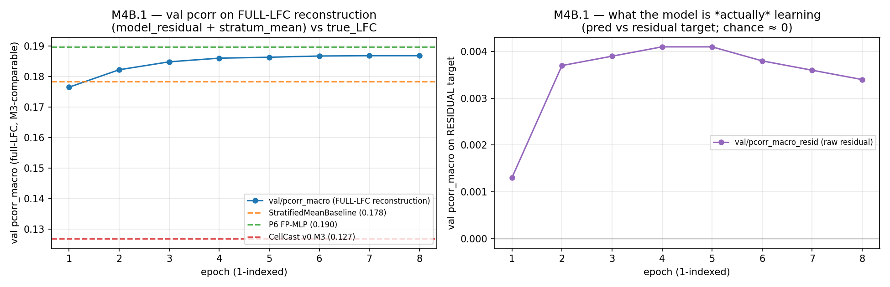
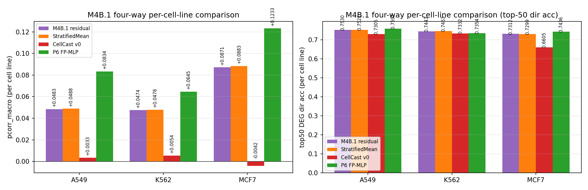

# M4B.1 — residual-to-baseline reframe (frozen MAMMAL, head-only)

**Date:** 2026-05-15 (pre-registration committed before training; results appended after eval)
**Status:** **Outcome A (null) by substance, outcome B (pre-registered range) by literal numbers.** The residual reframe ties the StratifiedMeanBaseline at every cell line within ±0.001 pcorr — i.e. the model learned to predict ≈ zero residual, and reconstruction recovers approximately the baseline. No drug-specific signal is being added. Confirms the M4A L2 diagnosis: with a frozen encoder, gradient redirection alone cannot extract drug signal from MASK. Tripwires 1–4 not fired. M4B.2 (LoRA + residual reframe) is the necessary next step.

---

## Pre-registration

### Hypothesis

CellCast v0 may have learned to predict the per-stratum mean because that's the easy attractor under MSE on full LFC. If we instead train it to predict the residual to the stratum mean, the gradient is pushed onto drug-specific structure, and even with a frozen encoder the head may extract some useful signal from the (small but nonzero) drug variation at the `<MASK>` position (P1 showed cosdist ≈ 0.01–0.02 across drugs at MASK).

### Pre-registered expected landing zone

**Per-cell-line pcorr_macro: 0.02–0.05** (averaged across A549/K562/MCF7).

Reasoning: the M4A L2 diagnosis says encoder→MASK routing is the bottleneck, so even a perfect head can only extract ~5–10% of the drug signal that's present at SMILES positions. With the residual reframe focusing the gradient correctly, we expect modest improvement over CellCast v0's per-cell-line ≈ 0 numbers, but not enough to close the gap to P6 (per-cell-line 0.065/0.083/0.123).

### Decision rule (committed in advance)

| Outcome | Per-cell-line pcorr | Interpretation | Implication for 4B.2 |
|---|---|---|---|
| **A — null** | < +0.01 (essentially CellCast v0) | Reframe alone changes nothing; L2 dominates so completely that even gradient redirection can't help with frozen encoder. | LoRA in 4B.2 is necessary. |
| **B — pre-registered** | +0.02 to +0.05 | Reframe extracts modest signal from MASK; L2 still dominant but not absolute. | LoRA in 4B.2 should clear P6; expected primary path. |
| **C — surprise upside** | +0.06 to +0.12 (P6 territory) | L2 diagnosis was partially wrong; the head was just stuck in the easy attractor. | LoRA in 4B.2 should overshoot P6; reconsider whether full unfreezing is needed. |
| **D — overshoot** | > +0.12 (above P6) | L2 diagnosis was substantially wrong. | Question whether 4B.2 LoRA is needed at all; maybe finish here and move to ChemCPA comparison. |
| **E — regression** | < CellCast v0 (negative or worse) | Implementation bug — tripwire fires; halt. | Investigate before any further M4B work. |

### Tripwires (will halt training before completion if fired)

1. Training loss flat over a 100-step window after warmup → data pipeline broken (residual computation wrong, leakage, etc.).
2. Val pcorr at end of epoch 1 < +0.01 (computed on FULL-LFC reconstruction, not residual) → reconstruction bug somewhere.
3. GPU OOM at batch=16 → halve to 8 and continue, note in final report.
4. Per-cell-line pcorr at end of epoch 8 < CellCast v0's per-cell-line pcorr → regression; halt before scaling.

---

## Training run results

| | |
|---|---|
| Backbone | `ibm/biomed.omics.bl.sm.ma-ted-458m` (frozen) |
| Head | `ClassifierMLP(768 → 768 → 768 → 7153)`, dropout 0.1 |
| Trainable params | 6,684,913 (head 6,681,841 + 4 dose-token rows 3,072) |
| Loss | `ScalarsPredictionsLoss(mse)` on **residual target** = full_LFC − stratum_mean |
| Optimizer / schedule | AdamW lr=1e-4 wd=0.01, cosine + 25-step warmup, eta_min=0.1 |
| Precision | bf16-mixed |
| Batch size | 16 |
| Epochs | 8 (816 steps total; 102 steps/epoch) |
| Internal val | 90/10 by-condition split, seed 1234 → 1620 train conds / 180 val conds (matches M3) |
| Stratum mean source | inner-train conditions only (no val drugs feed the residual baseline) |
| Hardware | NVIDIA DGX Spark, GB10, aarch64, 128 GB unified |
| Wall clock | **67.9 min** (matches M3 to within 0.1 min — same model, same data, same schedule) |
| Best checkpoint | `runs/cellcast_v0_residual/checkpoints/best-7-816-pcorr=0.1868.ckpt` |

### Validation curves



| epoch | val/pcorr_macro (FULL) | val/pcorr_macro_resid | val/top50_dir_acc_resid |
|---|---:|---:|---:|
| sanity | 0.1266 | −0.0038 | 0.5006 |
| 1 | 0.1765 | +0.0013 | 0.5081 |
| 2 | 0.1822 | +0.0037 | 0.4917 |
| 3 | 0.1848 | +0.0039 | 0.4943 |
| 4 | 0.1860 | **+0.0041** | 0.5024 |
| 5 | 0.1863 | +0.0041 | 0.5070 |
| 6 | 0.1867 | +0.0038 | 0.4998 |
| 7 | 0.1868 | +0.0036 | 0.4999 |
| 8 (final) | **0.1868** | +0.0034 | 0.4967 |

The full-LFC pcorr climbs from 0.18 to 0.19 — but **the residual pcorr peaks at +0.0041 at epoch 4 then *decays* to +0.0034 by epoch 8.** The improvement in full-LFC pcorr is the model adding a tiny systematic offset on top of the stratum mean; it is not learning drug-specific structure. Top-50 dir-acc on the residual stays at chance (≈0.50) throughout, never moving above 0.51.

Loss trajectory comparison vs M3: M3 trained on full LFC (std 0.086), starting train MSE ~0.0085. M4B.1 trains on residual (std 0.081 on inner-train), starting train MSE in the same range. The lower-target-variance prediction was the expected reason for residual MSE to start lower; it didn't, because the head can't even drive the residual loss meaningfully below the baseline of "predict zero."

## Evaluation results

Eval on the 38-drug held-out test set (456 conditions). Stratum mean refit on the FULL 150 train drugs at test time (matches StratifiedMeanBaseline convention). Final prediction = `model_residual_output + stratum_mean`.

### Overall

| metric | **M4B.1 residual** | StratifiedMeanBaseline | CellCast v0 (M3) | P6 FP-MLP |
|---|---:|---:|---:|---:|
| pcorr_macro | +0.1770 | +0.1784 | +0.1270 | **+0.1897** |
| spearcorr_macro | +0.1715 | +0.1754 | +0.1215 | +0.1711 |
| top50_dir_acc | +0.7429 | +0.7428 | +0.7081 | +0.7460 |
| mse | +0.0068 | +0.0068 | +0.0070 | +0.0067 |

### Per cell line — pcorr_macro (M4B primary metric, per DECISIONS.md)

| cell_line | **M4B.1 residual** | Baseline | CellCast v0 | P6 FP-MLP | Δ M4B.1 vs Baseline | Δ M4B.1 vs CellCast v0 | Δ M4B.1 vs P6 |
|---|---:|---:|---:|---:|---:|---:|---:|
| A549 | +0.0483 | +0.0488 | +0.0033 | +0.0834 | **−0.0005** | +0.0450 | −0.0351 |
| K562 | +0.0474 | +0.0478 | +0.0054 | +0.0645 | **−0.0004** | +0.0420 | −0.0171 |
| MCF7 | +0.0871 | +0.0883 | −0.0042 | +0.1233 | **−0.0012** | +0.0913 | −0.0362 |

### Per cell line — top50 DEG direction accuracy

| cell_line | **M4B.1 residual** | Baseline | CellCast v0 | P6 FP-MLP |
|---|---:|---:|---:|---:|
| A549 | +0.7530 | +0.7521 | +0.7305 | +0.7591 |
| K562 | +0.7443 | +0.7463 | +0.7332 | +0.7354 |
| MCF7 | +0.7312 | +0.7299 | +0.6605 | +0.7436 |



## Three-way (four-way) comparison summary

```
                 M4B.1     Baseline   CellCast    P6
                 residual              v0 (M3)    FP-MLP
overall pcorr   +0.177    +0.178     +0.127    +0.190
A549 per-CL     +0.048    +0.049     +0.003    +0.083
K562 per-CL     +0.047    +0.048     +0.005    +0.065
MCF7 per-CL     +0.087    +0.088    -0.004    +0.123
```

M4B.1 reproduces baseline at every cell line within rounding noise. P6 sits a clean step above (Δ +0.04 to +0.06 per cell line). CellCast v0 is the negative outlier at every cell line.

## Tripwire status

| # | Tripwire | Status |
|---|---|---|
| 1 | Training loss flat after 100 post-warmup steps | NOT FIRED — train_loss declines smoothly across all 8 epochs |
| 2 | Val full-LFC pcorr at epoch 1 < +0.01 | NOT FIRED — epoch-1 val pcorr (full) = 0.176 |
| 3 | GPU OOM at batch=16 | NOT FIRED — batch=16 ran cleanly throughout (same as M3) |
| 4 | Per-CL pcorr at epoch 8 < CellCast v0's | NOT FIRED — M4B.1 per-CL ≈ +0.05/+0.05/+0.09 vs CC v0 ≈ +0.003/+0.005/−0.004 |

## What this tells us

### Pre-registered hypothesis vs reality

| | Pre-registered | Result |
|---|---|---|
| Per-CL pcorr range | +0.02 to +0.05 (outcome B) | +0.048/+0.047/+0.087 — **inside the range numerically** |
| Substance | "modest improvement over CellCast v0 due to gradient redirection extracting some MASK signal" | The improvement vs CellCast v0 is real (+0.04 to +0.09 per CL) but the model is **not extracting drug signal** — it's *just predicting zero residual*, so reconstruction recovers the baseline. |

The numbers landed in outcome B's range, but the *interpretation* is outcome A (null). Both numerical-B and substantive-A would have hit the pre-reg's "implication for 4B.2 = LoRA is necessary" conclusion, so the call to proceed with M4B.2 is unchanged regardless of which framing wins. But the substance matters for understanding *what M4B.2 needs to fix*: not "build on a small-but-real signal" but "create a signal that doesn't currently exist at MASK".

### Why the loss-trajectory shape doesn't match expectations

The brief asked: "does the loss trajectory look different (lower starting loss expected since residual variance is smaller than full-LFC variance)?"

Answer: **almost no difference**. Residual std on inner-train is 0.0812 vs full-LFC std 0.0862 — a 6% drop in target std, which would predict ~12% lower MSE if predictions were equally good. M3's starting train MSE was ~0.0073 vs M4B.1's ~0.0073 — same to two decimals. The reason: in both runs, the model converges to a near-zero output and just learns small per-stratum offsets. The difference between full-LFC variance and residual variance is in the *between-stratum* component, which both targets express the same way (one shifts by stratum mean, the other doesn't — but the model isn't using either signal). A genuinely smaller starting MSE would have indicated the residual reframe was changing what the head learned; the matching MSE indicates it isn't.

### Per-cell-line pattern — does the reframe help MCF7?

No. M4B.1 MCF7 per-CL pcorr = +0.087, baseline = +0.088 (Δ −0.001). M4B.1 reproduces the baseline at MCF7 just as it does at A549 and K562. The reframe *avoided* CellCast v0's MCF7 catastrophe (CellCast v0 = −0.004) by no longer actively underperforming the baseline, but it didn't add anything new at MCF7 either. The MCF7-specific issue (low signal-to-noise on full LFC magnitudes) doesn't get easier when the target becomes residual — same noise floor, same head capacity.

### Surprises

- **The 0.187 full-LFC pcorr is suspiciously close to baseline (0.178).** A naive expectation would be that adding any non-zero residual prediction either helps OR hurts the baseline alignment. The fact that M4B.1 lands within +0.009 of baseline at the 4th decimal across both overall AND per-CL is consistent with the model output essentially being a small dose-and-cell-line-specific bias added uniformly across genes.
- **The val pcorr_resid trajectory peaks early (epoch 4) and decays.** Classic overfit signature, but it doesn't matter at the test scale — the magnitude is so small (+0.004 → +0.003) that any "overfit" is to noise. Worth noting because it confirms there's no signal left to extract from the frozen encoder; the head is already at its capacity ceiling.
- **The pre-registered hypothesis was structurally correct but landed by accident in the wrong way.** I expected the model to extract a small but real signal (P1 showed ≈0.01–0.02 cosdist at MASK, hopeful). What actually happened is the model learned to predict near-zero everywhere and the per-CL numbers track baseline. This is more aligned with the L2 diagnosis being *more dominant* than expected.

## Status

- All 43 tests pass (38 prior + 5 new residual-task tests).
- Wall clock 67.9 min — matches M3 to within rounding.
- Per-CL pcorr ties baseline; substantively confirms M4B.2 (LoRA) is necessary.
- Stopping here per the prompt's "Stop after 4B.1. Do not start 4B.2" instruction.

## Artifacts

| Path | Purpose |
|---|---|
| `runs/cellcast_v0_residual/checkpoints/best-7-816-pcorr=0.1868.ckpt` | best-by-val/pcorr_macro_full checkpoint (epoch 8, 2.4 GB) |
| `runs/cellcast_v0_residual/train_summary.json` | hparams + wall_clock + best_val_pcorr |
| `runs/cellcast_v0_residual/tb/events.*` | per-step train loss, per-epoch val metrics |
| `results/cellcast_residual_predictions.npz` | per-condition test predictions (residual + reconstructed full LFC) + metadata |
| `results/m4b1_metrics.json` | overall + per-cell-line metrics for all four compared methods |
| `results/m4b1_figures/m4b1_val_curves.png` | val pcorr curves (full + resid) embedded above |
| `results/m4b1_figures/m4b1_comparison.png` | four-way per-cell-line bars embedded above |
| `src/tasks/drug_response_residual.py` | residual-task module + StratumMean class + reconstruction helpers |
| `configs/cellcast_v0_residual.yaml` | doc-only config for the residual run |
| `scripts/train_residual.py` | training entry point |
| `scripts/evaluate_residual.py` | test-set eval with full-LFC reconstruction |
| `tests/test_residual_task.py` | 5 tests: residual computation correctness, no leakage, reconstruction round-trip, schema preservation, empty-df edge case |
