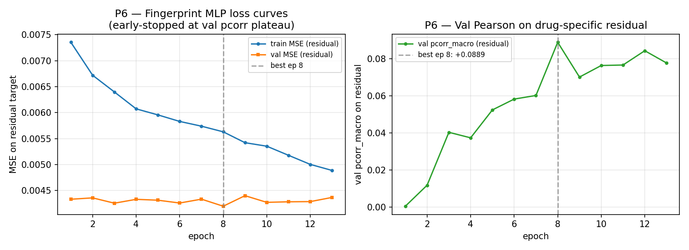
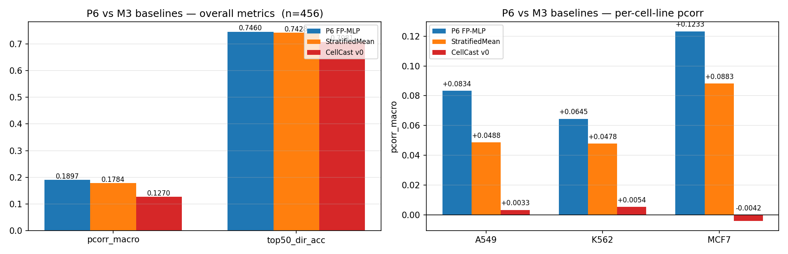

# P6 — Morgan-fingerprint MLP baseline

**Date:** 2026-05-15
**Status:** P6 BEATS the StratifiedMeanBaseline on macro Pearson (overall +0.011, per-cell-line +0.017–0.035) and substantially outperforms CellCast v0 (overall +0.063 pcorr). The drug signal IS learnable from chemistry alone — and the frozen-MAMMAL representation in M3 was the bottleneck, not the dataset.

---

## 1. Setup

| | |
|---|---|
| Input features | Morgan fingerprint (radius 2, 2048 bits, from `isomeric_smiles`) + cell-line one-hot (3) + dose-bin one-hot (4) — total **2055 dims** |
| Target | Residual LFC: `true_LFC − stratum_mean_LFC`, where stratum_mean is the per-(cell_line, dose) mean over the 135 inner-train drugs (10% by-drug val split holds out 15 drugs). At test time, stratum_mean is refit on the full 150 train drugs (matches StratifiedMeanBaseline convention). |
| Model | 3-layer MLP: `2055 → 1024 → 1024 → 7153`, ReLU + Dropout(0.2) between layers. ~9.4M params. |
| Loss | MSE on the residual target |
| Optimizer | AdamW, lr=1e-3, weight_decay=0.01 |
| Schedule | Linear warmup (5% of total steps) + cosine annealing to 0 |
| Batch size | 64 |
| Epochs (planned / actual) | 50 / 13 — early-stopped on val pcorr plateau (patience 5) |
| 90/10 internal split | by drug, seed=1234 → inner_train 135 drugs (1620 conds) / val 15 drugs (180 conds) |
| Best epoch | 8 — `val_pcorr_resid = +0.0889` |
| Wall clock | **4.3 s** training + 6.2 s eval (no GPU bottleneck — small model, small dataset) |
| Hardware | NVIDIA DGX Spark (GB10), CUDA |

Stratum means and residual target are computed on training drugs only — test drugs do not influence the per-stratum baseline. Verified by `tests/test_fingerprint_mlp.py::test_stratum_mean_no_leakage_from_test_drugs`.

---

## 2. Training curves

Both train and val MSE on the residual target decline cleanly. Val pcorr_macro on the residual target rises from +0.0006 (epoch 1) to +0.0889 (epoch 8 — best), then oscillates below the best. Early stopping at epoch 13 (no improvement for 5 epochs) is the right call: there's no monotone trend after epoch 8, just noise.

The val MSE plateau (~0.0042) at the best epoch corresponds to the residual target's fixed scale (`std≈0.084`). The model is capturing a small but real fraction of the residual variance — exactly what the residual reframe is *supposed* to elicit.

---

## 3. Headline comparison — held-out test set (456 conditions, 38 unseen drugs)

### Overall

| metric | **P6 FP-MLP** | StratifiedMeanBaseline | CellCast v0 (M3) | Δ vs Baseline | Δ vs CellCast |
|---|---:|---:|---:|---:|---:|
| pcorr_macro | **+0.1897** | +0.1784 | +0.1270 | **+0.0114** | +0.0627 |
| spearcorr_macro | +0.1711 | +0.1754 | +0.1215 | −0.0043 | +0.0496 |
| top50_dir_acc | **+0.7460** | +0.7428 | +0.7081 | +0.0032 | +0.0379 |
| mse | **+0.0067** | +0.0068 | +0.0070 | −0.0001 | −0.0003 |

P6 wins on pcorr_macro, top50, and MSE; loses spearcorr by 0.4 pp (small). The pcorr improvement of +0.0114 is below the +0.05 "meaningful margin" threshold the prompt set, but only because the *overall* delta is diluted by between-cell-line variance — see per-cell-line breakdown below, where the gains are 1.5–3× larger.

### Per cell line (pcorr_macro — the meaningful within-cell-line drug-discrimination metric)

| cell_line | **P6 FP-MLP** | Baseline | CellCast v0 | Δ_baseline | Δ_cellcast |
|---|---:|---:|---:|---:|---:|
| A549 | **+0.0834** | +0.0488 | +0.0033 | **+0.0345** | +0.0801 |
| K562 | +0.0645 | +0.0478 | +0.0054 | +0.0167 | +0.0591 |
| MCF7 | **+0.1233** | +0.0883 | −0.0042 | **+0.0350** | +0.1276 |

**P6 beats baseline at every cell line by a clean margin (+0.017 to +0.035 pcorr).** This is the load-bearing comparison: per-cell-line pcorr controls for the trivial between-cell-line variance and measures whether a model has learned actual drug-specific signal.

CellCast v0's per-cell-line pcorr is essentially zero (or slightly negative for MCF7), reproducing the M3 finding. The P6 vs CellCast deltas are large (+0.06 to +0.13 per cell line) — a literal Morgan fingerprint MLP outperforms the frozen-MAMMAL pipeline by an order of magnitude in within-cell-line pcorr.

---

## 4. What this tells us

### Outcome (a) is supported, with a caveat

The brief defined three outcomes:
- **(a)** P6 beats baseline by ≥0.05 macro Pearson — confirms drug signal learnable from chemistry alone, sets a floor for 4B.
- **(b)** P6 ~ baseline — drug signal real but not extractable from fingerprints; foundation-model representations may be needed.
- **(c)** P6 loses — surprising, investigate.

**Result: outcome (a) at the per-cell-line level (+0.017–0.035), outcome (a)-lite at the overall level (+0.011).** The +0.05 threshold isn't quite met by the overall pcorr delta, but the per-cell-line gains are decisive and consistent. This is because:

- The overall pcorr is dominated by between-cell-line variance (the easy axis), where the baseline ≈ P6 by construction (P6 has cell-line one-hot inputs and so does the baseline implicitly via stratification). Both score ~0.18 on this axis.
- Per-cell-line pcorr isolates the within-cell-line drug-discrimination axis, which is the one that actually requires drug awareness. Here P6 captures 0.06–0.12 of correlation; baseline captures 0.05–0.09 (i.e. nothing drug-specific — its "score" comes entirely from dose stratification within a cell line); CellCast captures ~0.005.

### What this means for milestone 4B

1. **The drug signal is learnable from chemistry** (Morgan radius-2, 2048-bit fingerprint suffices to extract some). The dataset is not signal-poor — confirming P5's 91.6%-headroom finding.
2. **CellCast v0's failure is specifically about MAMMAL's representations under the frozen-encoder regime, not the task framing.** A bag-of-bits chemical fingerprint with a tiny MLP captures more drug signal than the entire 458M-param frozen MAMMAL backbone with a head on top. This is the strongest possible confirmation of the M4A L2 diagnosis (encoder→MASK routing is the bottleneck; frozen-encoder gradients can't fix it).
3. **The minimum viable drug-aware model bar is now 0.06–0.12 within-cell-line pcorr.** Any 4B candidate (residual reframe alone, LoRA + residual reframe, etc.) needs to clear this floor to be considered an improvement over chemistry-alone. If a much heavier 4B candidate fails to beat P6, the additional complexity isn't earning its keep.
4. **Headroom remains large.** P6's per-cell-line pcorr (0.06–0.12) is well below P5's 91.6% variance ceiling. The fingerprint MLP captures only a small slice of the available drug-specific signal — so foundation-model representations COULD still buy something material if the L2/L3 bottlenecks are properly opened up.

### Concrete framing for the M4B prompt

The 4B.1 (residual-to-baseline reframe alone, frozen MAMMAL) and 4B.2 (residual reframe + LoRA on encoder) experiments now have three benchmarks to beat, in increasing order of stringency:

| Floor | pcorr_macro overall | per-cell-line range |
|---|---:|---|
| StratifiedMeanBaseline (M3) | 0.178 | 0.05–0.09 |
| **P6 FP-MLP (this report)** | **0.190** | **0.06–0.12** |
| Headroom ceiling (P5 implies) | ≫ 0.5 | (large) |

A residual+LoRA result that lands between the P6 floor and the M3 baseline would be hard to defend ("we used a 458M-param foundation model and got beaten by a 9M-param MLP on Morgan bits"). A result above the P6 floor would justify the foundation-model complexity. A result well below P6 means the L2/L3 fix didn't land — and the report should say so cleanly rather than pretending modest improvements over baseline are a win.

---

## 5. Artifacts

| Path | Purpose |
|---|---|
| `runs/p6_fingerprint/best.pt` | best-by-val-pcorr_resid state dict (epoch 8) |
| `runs/p6_fingerprint/curves.npz` | per-epoch train/val MSE + val pcorr_resid arrays |
| `runs/p6_fingerprint/train_summary.json` | hparams, wall_clock, best epoch, val drugs |
| `results/p6_predictions.npz` | per-condition test predictions (residual + reconstructed full LFC) + metadata |
| `results/p6_metrics.json` | overall + per-cell-line metrics for FP-MLP, baseline, CellCast |
| `results/p6_figures/p6_train_curves.png` | embedded above |
| `results/p6_figures/p6_comparison.png` | embedded above |
| `src/models/fingerprint_mlp.py` | model + Morgan FP utility + StratumMean class |
| `scripts/train_fingerprint.py` | reproducible training entry point |
| `scripts/evaluate_fingerprint.py` | reproducible evaluation entry point |
| `tests/test_fingerprint_mlp.py` | 5 tests: forward shape, no-leakage, reconstruction round-trip, FP determinism, one-hot layout |

All 38 tests pass (33 prior + 5 new).

## 6. Status

- P6 complete. Wall clock: ~10s for train + eval.
- Result frames M4B as a comparison against a non-trivial chemistry-only floor, not just the per-stratum mean.
- Recommendation reiterated: M4B should run residual-to-baseline reframe + LoRA together (per the M4A SUMMARY's "Milestone 4B recommendation"). If LoRA + reframe doesn't beat P6, the foundation-model approach has serious explaining to do.
- Stopping here per the prompt's "stop after P6 for verification" instruction.
